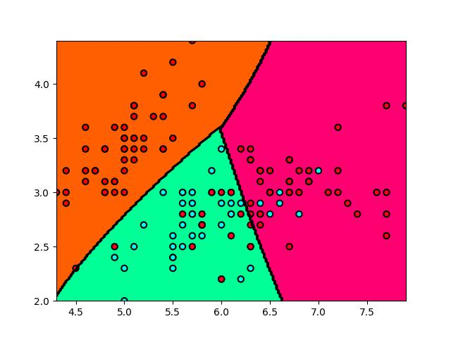
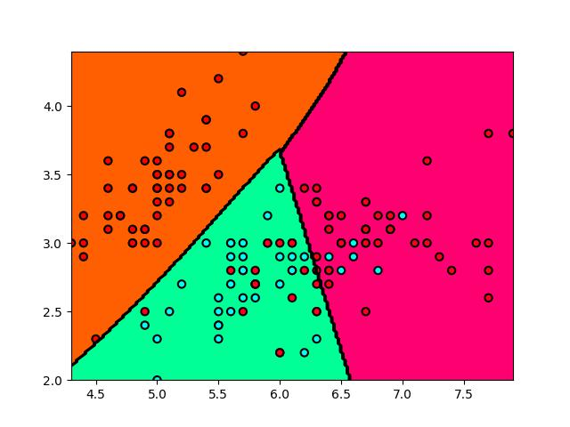
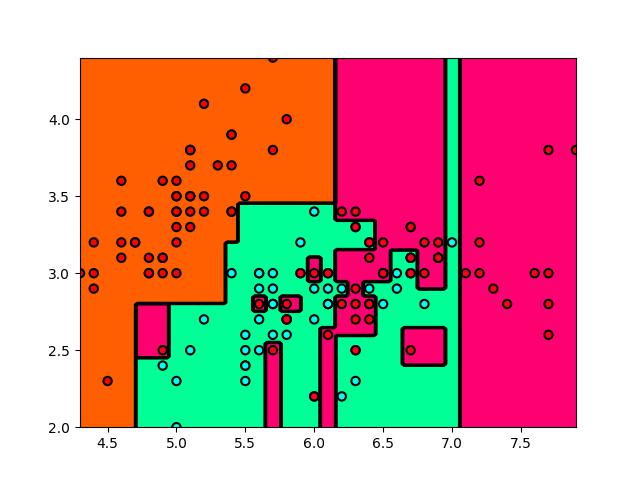
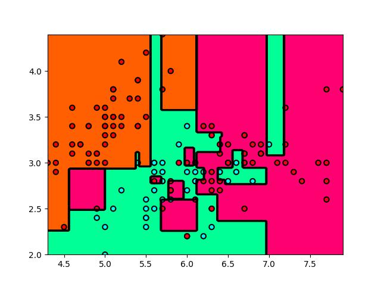

# 贝叶斯结果
```commandline
Building prefix dict from the default dictionary ...
Loading model from cache /var/folders/h4/qdmlvsbx67d1r79wvxt1nqhm0000gn/T/jieba.cache
Loading model cost 0.361 seconds.
Prefix dict has been built successfully.
测试集中一共有 1440 条样本，正确率为 100.00 %。

Process finished with exit code 0
```
# SVM 参数
把 C 改成了 0.5，把 tol 改成了 1e-3，结果没有变化，只是平面变平了。

<p align="center">课件上的原始参数</p>


<p align="center">C=0.5, tol=1e-3</p>

# 决策树参数
使用默认参数：


将 criterion 改为 entropy，splitter 改成 random，max_depth 改成 10：
