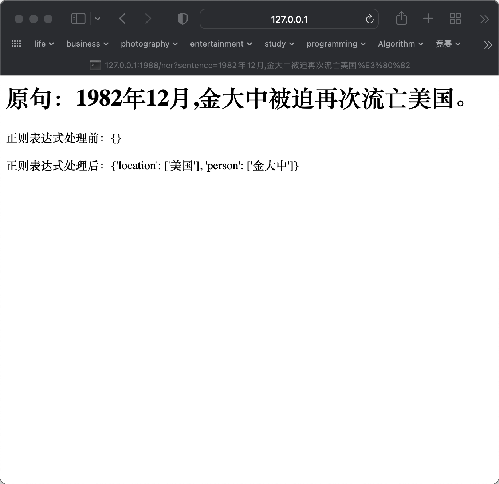

使用第九周命名实体识别的代码，运行 `check.py`：

```bash
(nlp) ➜  week_11 git:(main) ✗ python check.py
 * Serving Flask app 'check' (lazy loading)
 * Environment: production
   WARNING: This is a development server. Do not use it in a production deployment.
   Use a production WSGI server instead.
 * Debug mode: on
2022-02-17 06:16:11,077 - werkzeug - INFO -  * Running on http://127.0.0.1:1988/ (Press CTRL+C to quit)
2022-02-17 06:16:11,078 - werkzeug - INFO -  * Restarting with stat
2022-02-17 06:16:11,647 - werkzeug - WARNING -  * Debugger is active!
2022-02-17 06:16:11,655 - werkzeug - INFO -  * Debugger PIN: 638-847-962
```

在浏览器中输入 `http://127.0.0.1:1988/ner?sentence=1982年12月,金大中被迫再次流亡美国。`：


终端中信息为：

```bash
(nlp) ➜  week_11 git:(main) ✗ python check.py
 * Serving Flask app 'check' (lazy loading)
 * Environment: production
   WARNING: This is a development server. Do not use it in a production deployment.
   Use a production WSGI server instead.
 * Debug mode: on
2022-02-17 07:07:17,450 - werkzeug - INFO -  * Running on http://127.0.0.1:1988/ (Press CTRL+C to quit)
2022-02-17 07:07:17,450 - werkzeug - INFO -  * Restarting with stat
2022-02-17 07:07:17,965 - werkzeug - WARNING -  * Debugger is active!
2022-02-17 07:07:17,971 - werkzeug - INFO -  * Debugger PIN: 638-847-962
/Users/wenjiazhai/miniforge3/envs/nlp/lib/python3.8/site-packages/torchcrf/__init__.py:305: UserWarning: where received a uint8 condition tensor. This behavior is deprecated and will be removed in a future version of PyTorch. Use a boolean condition instead. (Triggered internally at  ../aten/src/ATen/native/TensorCompare.cpp:328.)
  score = torch.where(mask[i].unsqueeze(1), next_score, score)
2022-02-17 07:07:22,971 - werkzeug - INFO - 127.0.0.1 - - [17/Feb/2022 07:07:22] "GET /ner?sentence=1982年12月,金大中被迫再次流亡美国。 HTTP/1.1" 200 -
```